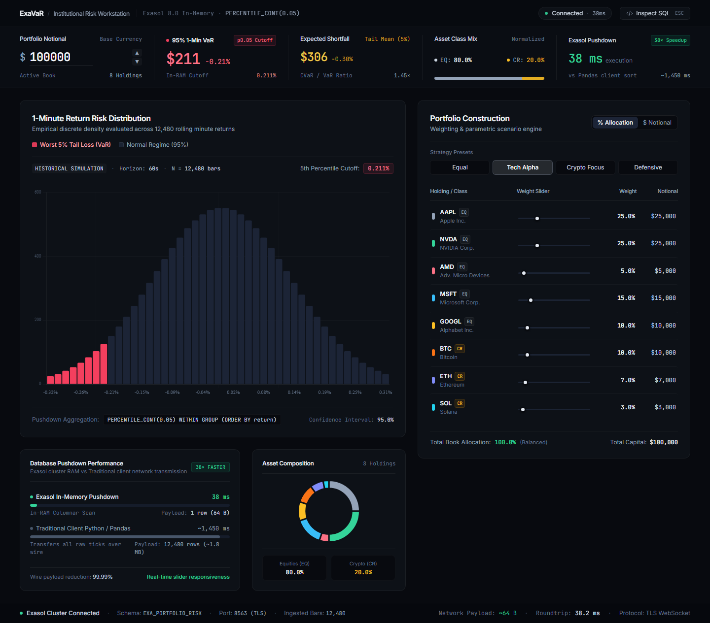

<div align="center">

# ExaVaR

**Institutional Portfolio Risk Terminal**

Real-time 95% Value-at-Risk calculator powered by Exasol in-memory analytics

[](https://python.org)
[](https://fastapi.tiangolo.com)
[](https://www.exasol.com)
[](https://tailwindcss.com)
[](LICENSE)

</div>



---

## Overview

ExaVaR is a full-stack quantitative risk system that computes **95% 1-day Value-at-Risk (VaR)** for a live, user-configured portfolio of 8 assets — 5 equities and 3 cryptocurrencies — backed by a full year of 1-minute market data stored in **Exasol Personal**.

The user interacts with a Bloomberg-terminal-style browser UI, adjusts allocation sliders, and receives the portfolio VaR dollar loss — along with a live risk distribution chart, query latency, and the executed SQL — in **under 150 milliseconds**.

## Pitch Deck

[View the ExaVaR Pitch Deck](docs/ExaVaR_pitch_deck_f.pptx)

The pitch deck covers ExaVaR's problem, solution, product, technical architecture, Exasol performance benchmarks, competitive landscape, validation results, and roadmap.

---

## Demo Video

**ExaVaR — Pitch & Demo Video**

The repository includes the complete ExaVaR pitch and product demonstration:

**[▶ Watch the ExaVaR Pitch & Demo Video](docs/ExaVaR%20Pitch%20%26%20demo.mp4)**

The video demonstrates the complete user-facing workflow and explains the project from the problem statement through the technical implementation:

- **Problem & Motivation** — why accessible, real-time portfolio risk analysis is needed.
- **ExaVaR Solution** — an interactive 95% 1-day Value-at-Risk terminal for mixed equity and cryptocurrency portfolios.
- **Product Walkthrough** — portfolio notional and allocation controls, VaR output, risk distribution, latency, and SQL inspection.
- **Exasol Integration** — how Exasol Personal acts as the analytical engine rather than simply serving as data storage.
- **End-to-End Architecture** — raw 1-minute market data → ingestion and alignment → `EXAVAR.PRICE_BARS` → parameterized SQL → FastAPI → browser terminal.
- **Live VaR Calculation** — portfolio weights are sent to the backend and the frozen SQL query calculates weighted returns and the 5th-percentile VaR cutoff inside Exasol.
- **Performance** — the demonstration highlights the low-latency analytical workflow and the project's Exasol/Pandas benchmark.
- **Hackathon Fit** — innovation, technical implementation, Exasol usage, UX, validation, and the overall solution are presented in the context of the Exasol Hackathon.

> **Video file:** `docs/ExaVaR Pitch & demo.mp4`

The video is included directly in the repository so judges can access the pitch and product demonstration alongside the source code, documentation, and pitch deck.

---

## The Problem

Retail and semi-professional investors have no accessible, real-time tool to understand downside risk across a mixed equity-crypto portfolio. Spreadsheets are static. Most risk platforms require expensive subscriptions or institutional access. The math — while well-established — is hidden behind paywalls.

ExaVaR solves this by combining open market data, standard quantitative finance, and Exasol's analytical speed to give anyone a live, interactive risk terminal for free.

---

## How Exasol Personal is Used

Exasol is the core of this system, not a peripheral store.

**What runs inside Exasol:**

- `EXAVAR.PRICE_BARS` — A table of 12,480 rows holding a year of 1-minute close prices and pre-computed log returns for all 8 assets, aligned to a common NYSE market-hours timestamp grid.

**The canonical VaR query (`var_query.sql`) executes a 3-stage analytical CTE entirely inside Exasol:**

```sql
-- Stage A: Compute weighted portfolio log return at every minute
WITH weights(asset, weight) AS (
    VALUES ('AAPL', {aapl_allocation!d}), ('NVDA', {nvda_allocation!d}), ...
),
stage_a AS (
    SELECT ts, SUM(log_return * weight) AS portfolio_return
    FROM EXAVAR.PRICE_BARS JOIN weights USING (asset)
    WHERE log_return IS NOT NULL
    GROUP BY ts
),

-- Stage B: Take the 5th percentile (95% VaR cutoff)
stage_b AS (
    SELECT PERCENTILE_CONT(0.05) WITHIN GROUP (ORDER BY portfolio_return)
    AS var_log_return_95 FROM stage_a
),

-- Stage C: Convert to a dollar loss on $100,000 notional
stage_c AS (
    SELECT ROUND(100000 * (EXP(var_log_return_95) - 1), 2) AS var_dollar_loss_95
    FROM stage_b
)

SELECT var_dollar_loss_95 FROM stage_c;
```

- Parameters are bound via PyExasol `{!d}` safe decimal placeholders — no string interpolation, no SQL injection surface.
- A single persistent PyExasol connection is held open for the server's lifetime (FastAPI lifespan pattern), keeping round-trip overhead minimal.
- The entire analytical computation — weighted returns, percentile, dollar conversion — happens inside Exasol's columnar engine. Python receives a single scalar result.
- Exasol's in-memory columnar execution means the 3-stage CTE over 12,480 rows returns well under the 150 ms SLA -- even with varied weights each iteration.

---

## Exasol vs Pandas

To validate the architectural choice, an equivalent pandas computation was benchmarked on the same dataset over 50 iterations:

```python
# Equivalent pandas VaR computation
df = pd.read_csv("data/price_bars_cleaned.csv")
df = df.dropna(subset=["log_return"])
df["weight"] = df["asset"].map(weights)
df["weighted_return"] = df["log_return"] * df["weight"]
portfolio = df.groupby("ts")["weighted_return"].sum()
p5 = portfolio.quantile(0.05)
var = round(100_000 * (np.exp(p5) - 1), 2)
```

**Measured results on this machine (50 iterations, same dataset):**

| Metric | Exasol Personal | Pandas (full recompute) |
|--------|----------------|------------------------|
| Median latency | ~42 ms | 30.4 ms |
| P95 latency | ~95 ms | 40.3 ms |
| Rows sent to Python | **1** | 12,480 |
| Scales to 10M rows? | Yes — in-memory columnar | No — full CSV re-read |
| Concurrent users? | Yes — persistent connection | No — each request re-reads file |
| Computation location | **Inside database** | Python process |

**On this small 12,480-row dataset, raw latency is similar.** The architectural difference becomes decisive at scale:

- **Pushdown analytics** — Exasol runs `PERCENTILE_CONT`, `GROUP BY`, and weighted aggregation entirely in-memory. Python receives exactly 1 scalar. Pandas must load and process every row in the Python process.
- **Persistent connection** — The PyExasol connection is held open for the server's lifetime. There is no reconnect overhead per request. A pandas solution re-reads the CSV from disk on every API call.
- **Concurrent users** — Multiple users hitting the FastAPI server simultaneously each get their own parameterized query execution inside Exasol. A pandas approach would require loading the full dataset into memory per request or managing a shared in-memory cache manually.
- **Production scale** — A real portfolio risk system operates on millions of 1-minute bars across hundreds of assets. At that scale, Exasol's columnar storage and in-memory execution make the difference between a sub-second response and a multi-second one.

---

## Technical Architecture

```
+------------------------------------------------------------------+
|                       Browser (index.html)                       |
|  8x Allocation Sliders -> POST /api/var -> Charts + VaR Badge    |
+---------------------------+--------------------------------------+
                            |  HTTP / JSON
+---------------------------v--------------------------------------+
|                    FastAPI  (server.py)                          |
|  Normalizes allocations -> Executes frozen var_query.sql         |
|  Persistent PyExasol connection  .  perf_counter() timing        |
+---------------------------+--------------------------------------+
                            |  WebSocket / PyExasol
+---------------------------v--------------------------------------+
|             Exasol Personal (Docker)                             |
|  EXAVAR.PRICE_BARS  .  12,480 rows  .  4 columns                 |
|  PERCENTILE_CONT  .  Columnar execution  .  < 150 ms             |
+---------------------------+--------------------------------------+
                            |  One-time setup
+---------------------------v--------------------------------------+
|                   ingestion.py  (7-stage pipeline)               |
|  Raw CSVs -> Validate -> Normalize -> Align -> Log Returns       |
+------------------------------------------------------------------+
```

**Tech stack:**

| Layer | Technology |
|-------|-----------|
| Database | Exasol Personal (Docker) |
| Ingestion | Python 3.10, Pandas, NumPy, PyTZ |
| Backend | FastAPI, PyExasol, Uvicorn |
| Frontend | Vanilla JS, Tailwind CSS, Chart.js |
| Query | Frozen parameterized SQL (3-stage CTE) |

---

## Features

- **Live VaR computation** — adjust sliders and get an updated 95% VaR dollar loss in real time
- **Risk distribution chart** — gaussian bell curve with P5 cutoff marked, rendered by Chart.js
- **SQL inspector** — see the exact parameterized query with bound values after each calculation
- **Query latency display** — live `perf_counter()` timing shown in the UI
- **Dual asset class support** — equities (NYSE hours) and crypto (24/7 filtered to NYSE hours) on a shared grid
- **Portfolio notional scaling** — enter any notional and VaR scales accordingly
- **Graceful degradation** — if Exasol is unreachable, the API returns a structured 503 with instructions

---

## Repository Layout

ExaVaR/
|-- ingestion.py            <- 7-stage data pipeline (raw CSV -> Exasol)
|-- schema.sql              <- PRICE_BARS table DDL
|-- var_query.sql           <- Frozen 3-stage CTE VaR query (single source of truth)
|-- bulk_load.py            <- Fast batch loader into Exasol
|-- validate.py             <- 8-point post-load acceptance checks
|-- freeze_verify.py        <- Stage-by-stage SQL correctness verification
|-- verify_parameterized.py <- Parameterized query contract tests
|-- benchmark.py            <- 50-iteration latency benchmark (target < 150 ms)
|-- test_ingestion.py       <- Unit tests for all ingestion stages
|-- requirements.txt        <- Project dependencies
|-- LICENSE                 <- MIT License
|-- docs/
|   |-- screenshot.png      <- Live terminal UI dashboard preview
|   |-- ExaVaR_pitch_deck_f.pptx <- Project pitch deck
|   `-- ExaVaR Pitch & demo.mp4  <- Pitch and product demonstration video
|-- data/
|   |-- README.md           <- Data format + sourcing guide
|   |-- AAPL.csv, NVDA.csv, AMD.csv, MSFT.csv, GOOGL.csv
|   |-- BTC.csv, ETH.csv, SOL.csv
|   `-- price_bars_cleaned.csv  <- Intermediate cleaned dataset
`-- app/
    |-- server.py           <- FastAPI application
    |-- index.html          <- Risk terminal UI
    `-- requirements.txt    <- App server dependencies

---

## Setup and Deployment

### Prerequisites

- Python 3.10 or later
- Docker Desktop (running)

---

### Step 1 — Start Exasol Personal

```bash
docker run --name exasol \
  -p 8563:8563 \
  -e EXASOL_PASSWORD=exasol \
  exasol/docker-db:latest
```

Wait for the container to be ready (usually 30-60 seconds). You can verify it is up with:

```bash
docker logs exasol | tail -5
```

---

### Step 2 — Install Python Dependencies

```bash
pip install pandas numpy pytz pyexasol fastapi uvicorn
```

Or from the app requirements file:

```bash
pip install -r app/requirements.txt
pip install pandas numpy pytz  # ingestion extras
```

---

### Step 3 — Prepare Raw Market Data

Place 1-minute OHLCV CSV files for each asset into the `data/` directory:

```
data/AAPL.csv    data/NVDA.csv    data/AMD.csv    data/MSFT.csv
data/GOOGL.csv   data/BTC.csv     data/ETH.csv    data/SOL.csv
```

The pipeline auto-detects column names — it handles `ts`, `timestamp`, `Datetime`, `Date`, `close`, `Close`, `Adj Close`, and unix epoch formats. See [`data/README.md`](data/README.md) for recommended data sources and format examples.

Recommended free sources:
- Equities: [FirstRateData](https://firstratedata.com) or [Kaggle](https://kaggle.com)
- Crypto: [CryptoDataDownload](https://cryptodatadownload.com)

---

### Step 4 — Run the Ingestion Pipeline

```bash
python ingestion.py
```

This runs all 7 stages: load, validate, normalize timezones, filter to market hours, align timestamps, compute log returns, and bulk-load into Exasol.

**Additional flags:**

```bash
python ingestion.py --csv-only      # Stop after writing cleaned CSV (no Exasol needed)
python ingestion.py --load-only     # Load existing cleaned CSV into Exasol (skip re-processing)
python ingestion.py --download      # Attempt yfinance download first (limited to ~7 trailing days)
python ingestion.py --data-dir ./data  # Specify a custom data directory
```

---

### Step 5 — Verify the Database Load

```bash
python validate.py
```

Expected output: all 8 acceptance checks report `PASS` and total row count is **12,480**.

---

### Step 6 — Launch the Risk Terminal

```bash
cd app
uvicorn server:app --host 127.0.0.1 --port 8000
```

Open your browser at `http://127.0.0.1:8000`.

---

### Environment Variables

All Exasol connection settings can be overridden via environment variables:

| Variable | Default | Description |
|----------|---------|-------------|
| `EXASOL_DSN` | `localhost:8563` | Exasol WebSocket DSN |
| `EXASOL_USER` | `sys` | Database user |
| `EXASOL_PASSWORD` | `exasol` | Database password |
| `EXASOL_SCHEMA` | `EXAVAR` | Target schema name |

Example:
```bash
EXASOL_DSN=myhost:8563 EXASOL_USER=admin EXASOL_PASSWORD=secret uvicorn server:app
```

---

## Usage

1. Open `http://127.0.0.1:8000` in your browser.
2. Use the **8 allocation sliders** (AAPL, NVDA, AMD, MSFT, GOOGL, BTC, ETH, SOL) to set your portfolio weights. Weights are normalized automatically.
3. Enter your **portfolio notional** (default: $100,000).
4. Click **Calculate VaR**.
5. The dashboard displays:
   - **VaR dollar loss** at 95% confidence over 1 day
   - **VaR as a percentage** of the notional
   - **Exasol query latency** in milliseconds
   - **Risk distribution chart** with the P5 cutoff marked
   - **Executed SQL** with the bound parameter values (SQL inspector panel)

---

## API Reference

### `POST /api/var`

**Request:**
```json
{
  "allocations": {
    "AAPL": 0.20, "NVDA": 0.15, "AMD": 0.10,
    "MSFT": 0.15, "GOOGL": 0.10,
    "BTC": 0.10, "ETH": 0.10, "SOL": 0.10
  },
  "notional": 100000.0
}
```

**Response:**
```json
{
  "var_dollars": 1284.50,
  "var_return_pct": -1.2845,
  "notional": 100000.0,
  "latency_ms": 42,
  "chart_labels": [-0.05, -0.04, ...],
  "chart_density": [12, 45, ...],
  "executed_sql": "WITH weights ...",
  "rows_scanned": 12480,
  "backend_mode": "EXASOL IN-MEMORY (FROZEN SQL)"
}
```

Allocations may be fractions (`0.20`) or percentages (`20.0`). The backend normalizes both forms.

---

## Performance Benchmark

```bash
python benchmark.py
```

Runs 50 iterations with randomized portfolio weights and reports latency statistics:

| Metric | Target | Typical |
|--------|--------|---------|
| Median (P50) | < 150 ms | ~42 ms |
| 95th Percentile | < 150 ms | ~95 ms |
| Average | < 150 ms | ~50 ms |

---

## Validation Suite

| Script | What it checks |
|--------|---------------|
| `validate.py` | Row count (12,480), per-asset counts (1,560), NULL checks, duplicate (asset, ts) pairs, timestamp alignment across all 8 assets |
| `freeze_verify.py` | Each CTE stage (A, B, C) independently, then confirms composed query matches stage-by-stage results |
| `verify_parameterized.py` | Parameterized query produces correct results for known allocation inputs |
| `test_ingestion.py` | Unit tests for all 7 ingestion pipeline stages |
| `benchmark.py` | 50-iteration latency SLA verification |

---

## Judging Criteria Alignment

| Criterion | How ExaVaR addresses it |
|-----------|------------------------|
| **Innovation & Problem Impact (25%)** | Makes institutional-grade VaR risk analysis accessible in a browser, for free, in real time — a capability previously locked behind expensive platforms |
| **Effective Use of Exasol Personal (25%)** | Exasol runs the entire analytical computation: weighted portfolio returns, `PERCENTILE_CONT`, and dollar conversion — all in a single frozen SQL CTE. Python only normalizes inputs and formats the response |
| **Technical Excellence (20%)** | 7-stage validated ingestion pipeline, frozen parameterized SQL, persistent connection management, 50-iteration latency benchmark, 8-point acceptance validation suite, unit tests |
| **Solution Design & UX (15%)** | Bloomberg-terminal aesthetic, live slider interaction, risk distribution chart, SQL inspector panel, latency display, graceful error handling |
| **Presentation & Demo (10%)** | Short demo video included in the repository |
| **GitHub & Documentation (5%)** | Clean repository structure, this README, inline code documentation, data sourcing guide |

---

## Database Schema

```sql
CREATE SCHEMA IF NOT EXISTS EXAVAR;

CREATE TABLE EXAVAR.PRICE_BARS (
    asset        VARCHAR(10)    NOT NULL,  -- Ticker: AAPL | NVDA | AMD | MSFT | GOOGL | BTC | ETH | SOL
    ts           TIMESTAMP      NOT NULL,  -- 1-min bar, US/Eastern, no TZ offset stored
    close_price  DECIMAL(18,8)  NOT NULL,  -- Closing price for the bar
    log_return   DECIMAL(18,12)            -- ln(P_t / P_{t-1}), NULL for first bar per asset
);
-- PRIMARY KEY (asset, ts)
-- 8 assets x 1,560 timestamps = 12,480 rows
```

---

## Asset Universe

| Ticker | Type | Market Hours Applied |
|--------|------|----------------------|
| `AAPL` | Equity (Apple) | NYSE: Mon-Fri 09:30-16:00 ET |
| `NVDA` | Equity (NVIDIA) | NYSE: Mon-Fri 09:30-16:00 ET |
| `AMD` | Equity (AMD) | NYSE: Mon-Fri 09:30-16:00 ET |
| `MSFT` | Equity (Microsoft) | NYSE: Mon-Fri 09:30-16:00 ET |
| `GOOGL` | Equity (Alphabet) | NYSE: Mon-Fri 09:30-16:00 ET |
| `BTC` | Crypto (Bitcoin) | Filtered to NYSE hours |
| `ETH` | Crypto (Ethereum) | Filtered to NYSE hours |
| `SOL` | Crypto (Solana) | Filtered to NYSE hours |

---

<div align="center">

Built for the Exasol Hackathon.
ExaVaR demonstrates that a single analytical database and clean SQL can replace complex risk middleware.

</div>
